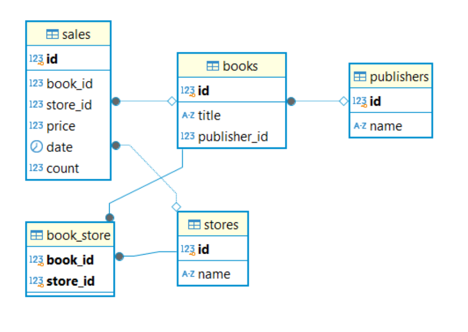

## Домашнее задание «Python и БД. ORM»

1. Создайте файл с названием **.env** в этой же папке  со следующим содержимым:
- **DRIVER** = # драйвер подключения   
- **DBNAME** = # укажите название вашей базы данных
- **USER** = # укажите имя пользователя базы данных
- **PASSWORD** = # укажите пароль пользователя базы данных
- **HOST** = # укажите хост базы данных
- **PORT** = # укажите порт базы данных

2. Запустите файл **main.py**
   
   
 > список писателей на выбор: Лев Толстой,
Фёдор Достоевский,
Антон Чехов,
Александр Пушкин,
Николай Гоголь,
Иван Тургенев,
Максим Горький,
Борис Пастернак,
Владимир Набоков,
Марина Цветаева.